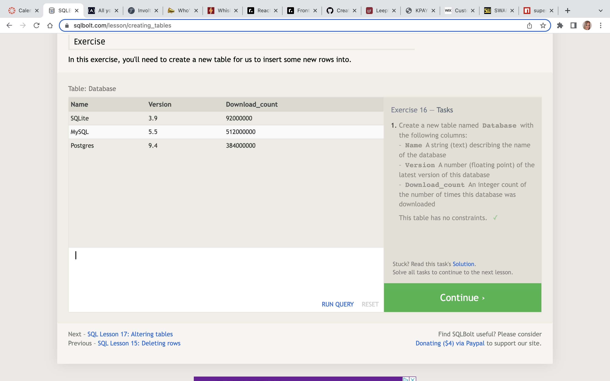

## [SQL Practice](https://codefellows.github.io/common_curriculum/prework/SQL)
___

### [Download Free Book](https://cdn2.hubspot.net/hubfs/392937/Learn%20SQL.pdf)
___
* Skim the book.
* Save this for later reference.

### Practice running common SQL commands using the following [SQL Bolt](https://sqlbolt.com/) tutorials.
____
Lessons 1 through 6 - SQL Queries
Lessons 13 through 18 - Database Management
For each of the tutorial sections:

* Read the guidance.
* Complete the exercises.
* Capture a screen shot of the completed task list.

#### Lesson 1
* Lesson 1  
#### Lesson 2
* Lesson 2  
#### Lesson 3
* Lesson 3  
#### Lesson 4
* Lesson 4  
#### Lesson 5
* Lesson 5  
#### Lesson 6
* Lesson 6  
#### Lesson 7
* Lesson 7  
#### Lesson 8
* Lesson 8  
#### Lesson 9
* Lesson 9  
#### Lesson 10
* Lesson 10  
#### Lesson 11
* Lesson 11  
#### Lesson 12
* Lesson 12  
#### Lesson 13
* Lesson 13  
(This lesson shows how to add to a database)
#### Lesson 14
* Lesson 14  
(This lesson shows how to update a database)
#### Lesson 15
* Lesson 15  
(This lesson shows how to delete a database)
#### Lesson 16
* Lesson 16  
(This lesson shows how to add a table to a database)
#### Lesson 17
* Lesson 17  
(This lesson shows how to add a column to a database)
#### Lesson 18
* Lesson 18  
(This lesson shows how to drop a table (and it's schema) from  a database)

