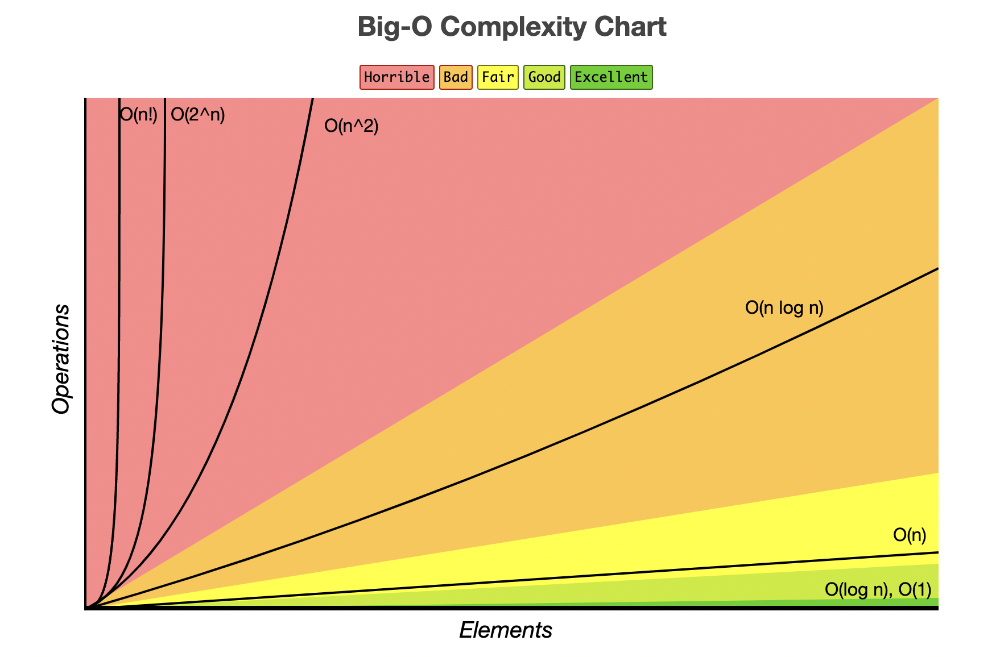

## Data Structures and Algorithms
____

Good code is efficient code. Understanding the "Big O" ensures that you can beat the carrier pigeon in transferring data. 

[Cheat Sheet](https://www.bigocheatsheet.com/)

### Watch
___
#### [Basic Recursion](https://www.youtube.com/watch?v=vPEJSJMg4jY)

##### Recursion: Recursion is where a function calls itself. 

* it is used to make the code cleaner and easier to understand.
* Because a recursive function calls itself, it can be easy to write a function that creates an infinite loop. 
* To prevent this, Recursive functions have two cases. 

1. a Base Case- when the function does not call itself again.
2. a Recursive Case- when the function calls itself
 

#### [Data Structures in 15 Minutes](https://www.youtube.com/watch?v=sVxBVvlnJsM)
* This video explains the data structures you 'must' know and tries to explain them without using jargon.

#### [Big O Explained](https://www.youtube.com/watch?v=v4cd1O4zkGw)
* The Big O is algorithmic efficiency. It is how time scales with respect to some input variables. 
* 4 important rules to know with the big O.
1. If you have two different steps in your algorithm, you add up those
steps.
2. Drop constants
3. If you have different inputs you're usually going to use different variables to represent them.
4. Drop non-dominant terms. 
* She recommends you try these using practicing a lot of different exercises. 
* She also has other videos discussing white board interviews, so might be worth a watch! 

### Read
____
#### [Basic Data Structures](https://towardsdatascience.com/8-common-data-structures-every-programmer-must-know-171acf6a1a42)

1. Arrays

##### Array operations

* Traverse: Go through the elements and print them.
* Search: Search for an element in the array. You can search the element by its value or its index
* Update: Update the value of an existing element at a given index

2. Linked Lists

* A linked list is a sequential structure that consists of a sequence of items in linear order which are linked to each other. 
* You have to access data sequentially and random access is not possible.
* Elements in a linked list are known as nodes.
* Each node contains a key and a pointer to its successor node, known as next.
* The attribute named head points to the first element of the linked list.
* The last element of the linked list is known as the tail.
##### Linked list operations
* Search
* Insert
* Delete

3. Stacks
* A stack is a LIFO (Last In First Out — the element placed at last can be accessed at first)
##### Stack operations
* Push
* Pop
* Peek
* Is Empty
* Is Full

4. Queues
* A queue is a FIFO (First In First Out — the element placed at first can be accessed at first)
##### Queue operations
* **Enqueue:** Insert an element to the end of the queue.
* **Dequeue:**  Delete the element from the beginning of the queue.

5. Hash Tables
* A Hash Table is a data structure that stores values which have keys associated with each of them.
##### Applications of hash tables
* Used to implement database indexes.
* Used to implement associative arrays.
* Used to implement the “set” data structure.

6. Trees
* A tree is a hierarchical structure where data is organized hierarchically and are linked together. 
##### Binary Search Trees
* A binary search tree (BST), as the name suggests, is a binary tree where data is organized in a hierarchical structure. This data structure stores values in sorted order.
##### Applications of trees
* **Binary Trees:** Used to implement expression parsers and expression solvers.
* **Binary Search Tree:** used in many search applications where data are constantly entering and leaving.
* **Heaps:** used by JVM (Java Virtual Machine) to store Java objects.
* **Treaps:** used in wireless networking.

7. Heaps
* A Heap is a special case of a binary tree where the parent nodes are compared to their children with their values and are arranged accordingly.

8. Graphs
* A graph consists of a finite set of vertices or nodes and a set of edges connecting these vertices.
##### Applications of graphs
* Used to represent social media networks. Each user is a vertex, and when users connect they create an edge.
* Used to represent web pages and links by search engines. Web pages on the internet are linked to each other by hyperlinks. Each page is a vertex and the hyperlink between two pages is an edge. Used for Page Ranking in Google.
* Used to represent locations and routes in GPS. Locations are vertices and the routes connecting locations are edges. Used to calculate the shortest route between two locations.

[Cheat Sheet](https://www.bigocheatsheet.com/)

#### Why Big O
* *This particular article would not open for me due to security issues. So I read other articles with similar titles, and this is the key take away point:*

"Big-O tells you the complexity of an algorithm in terms of the size of its inputs. This is essential if you want to know how algorithms will scale. If you need to design a big website and expect a lot of users, the time it takes you to handle user requests is critical." - Key Lime interactive

#### Discussion Questions
____

#### What is 1 of the more important things you should consider when deciding which data structure is best suited to solve a particular problem?
How an algorithm will scale, and the resulting time involved. 

 "It's crucial to understand the time complexity of the operations that will be performed on the data structure and how they relate to the size of the data structure." -ChatGPT

#### How can we ensure that we’ll avoid an infinite recursive call stack?
* make sure you have a base case where the function does not call itself, in addition to the recursive case. 

### Additional Reading:

#### [Big-O Notation](https://www.linkedin.com/pulse/big-o-notation-simple-explanation-examples-pamela-lovett/)

* This is a great overview of Big-O notation using a book as an example, providing a vivid visual to help you grasp the concept. 
