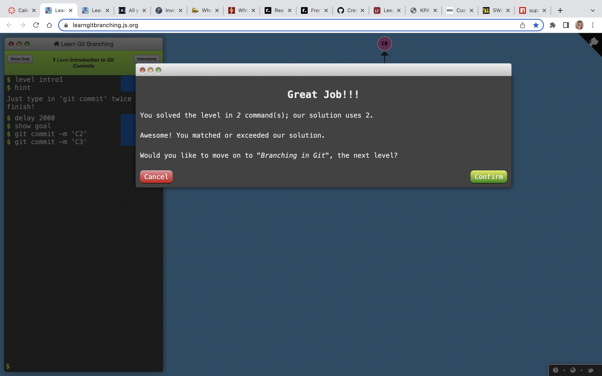
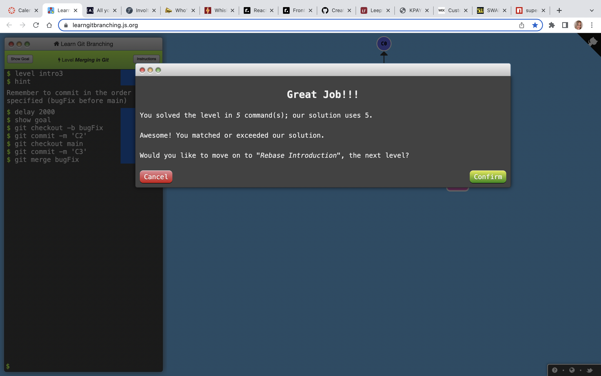
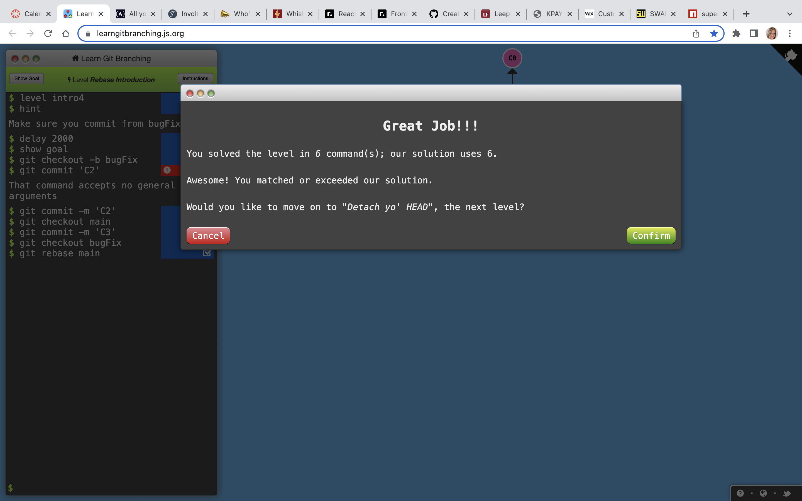

[gitpractice](https://learngitbranching.js.org/)

### Lessons:

#### Level 1
___
* ##### git commit  
    * git commit -m 'what you did for this commit'

* ##### git branches  
    * git branch newBranch - creates a new branch
    * git checkout -b newBranchName - makes a new branch and moves you to it
    * git switch branchName(or git checkout branchName) -moves you to a different branch

* ##### git merge 
    * git merge branchName will merge the branchName with the branch you are currently on.

 * ##### git rebasing 
    * git rebase branchToMoveTo  - This command will move the commits of the branch you are currently on, to the branch you name. To fully combine you need to then move (checkout) to the branchToMoveTo and git rebase branchYouAreCurrentlyOn. 

#### Level 2
___
* ##### Moving around in Git  
* HEAD is the commit you are working on top of
* *git checkout commitName* will move HEAD from a branch to a commit

* ##### Relative Refs  
* Moving upwards one commit at a time with ^
* Moving upwards a number of times with ~<num>
* *git checkout main^* will move HEAD one generation up. ^^ will move it two, etc

* ##### Relative Refs #2  
* *git checkout HEAD~4* will move HEAD up four spaces
* *git branch -f main HEAD~3*  moves (by force) the main branch to three parents behind HEAD.

* ##### Reversing changes in Git  
* *git reset* reverses changes by moving a branch reference backwards in time to an older commit. LOCAL ONLY
* *git reset HEAD~1* moves reference back by 1 from Head
* *git revert branchName* works for remote branches

#### Level 3 - Moving Work Around
___
* #####  git cherry-pick 
* *git cherry-pick commitName commitName* adds commits from other branches onto your current branch

* #####  Interactive rebase 
* Discusses an interactive way to rebase using a command such as: *git rebase -i HEAD~4*
* This would be a good way to go through and remove and change the order of commits if you have one that has changes you do not want. 

#### Level 4
___
* #####  
* #####  
* #####  
* #####  