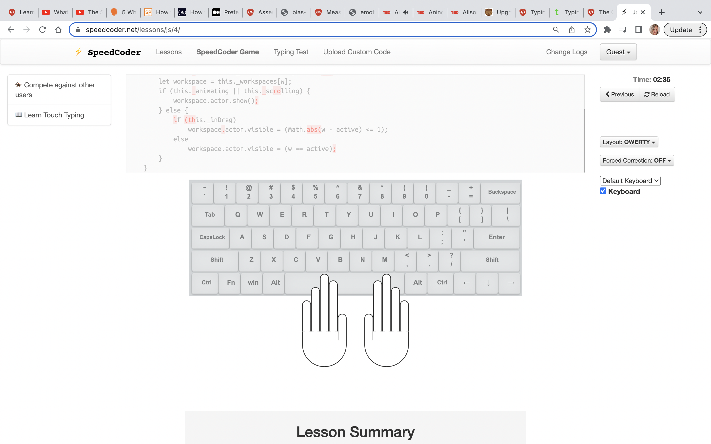
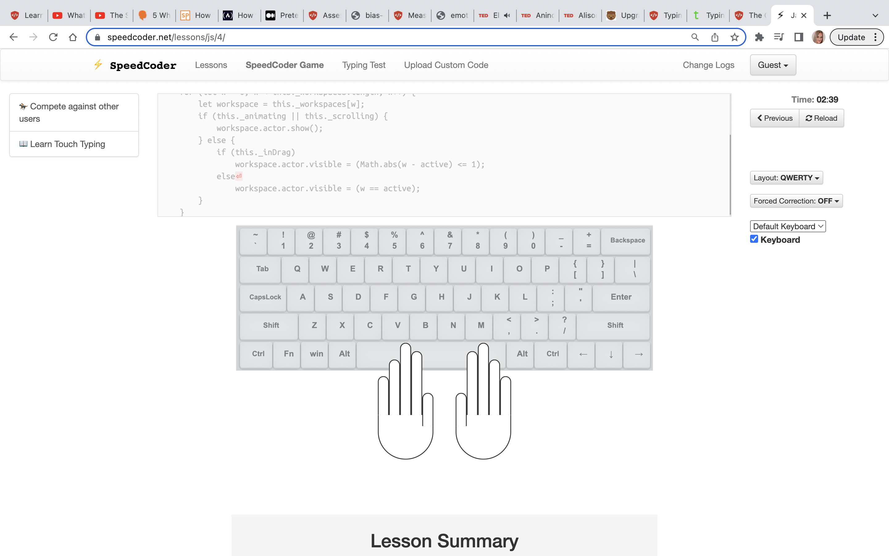
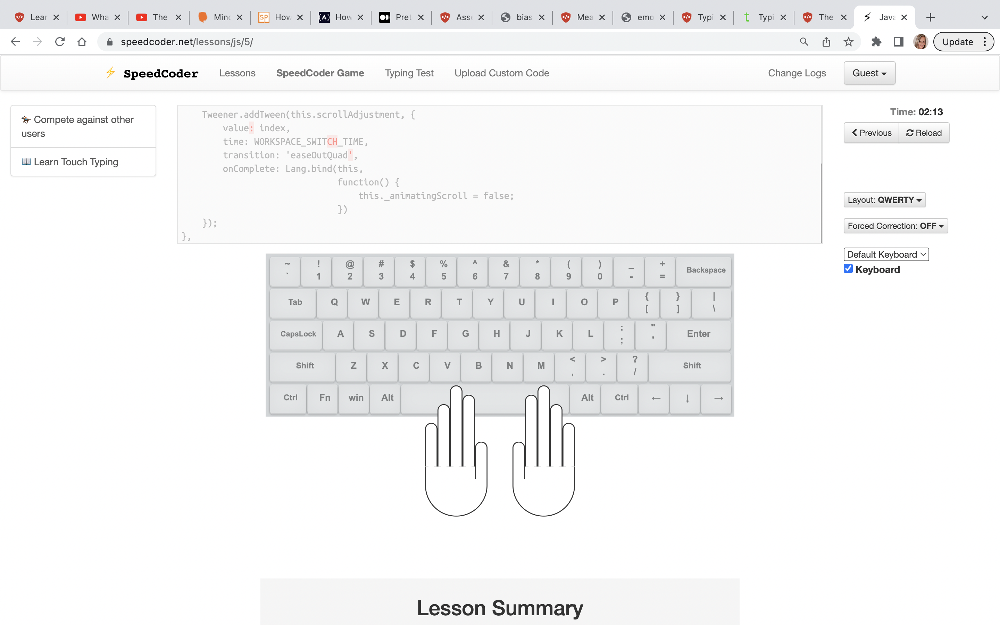
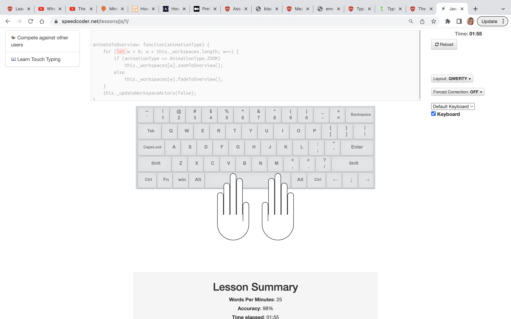
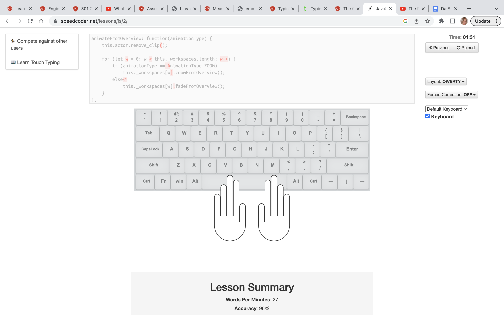
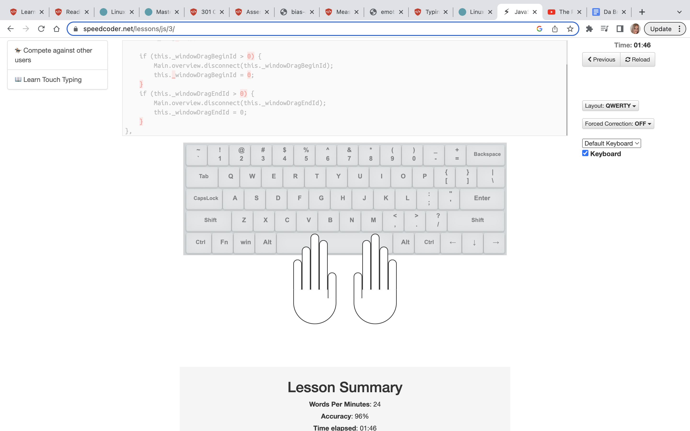
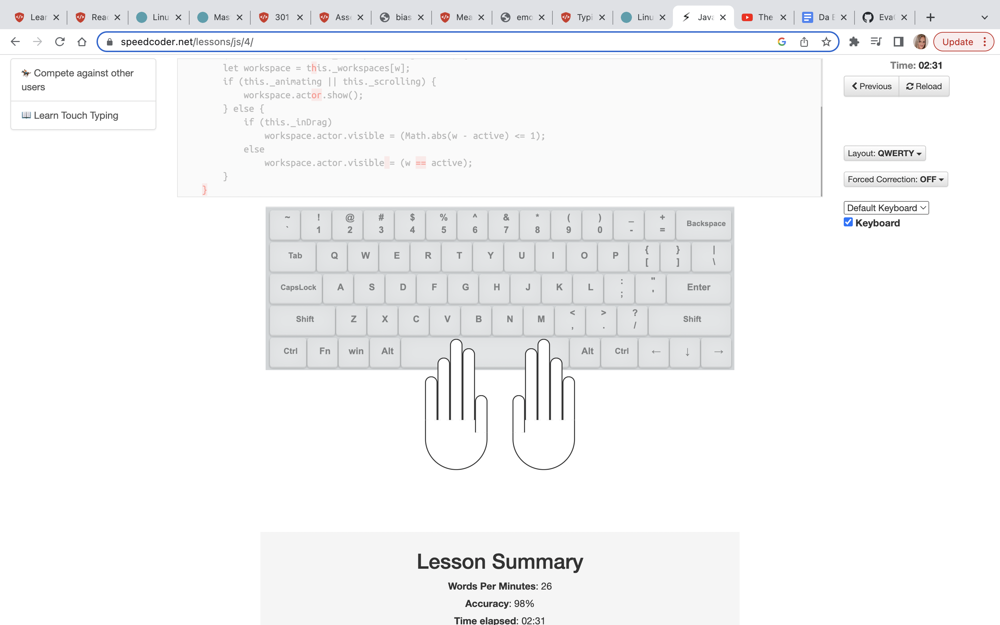
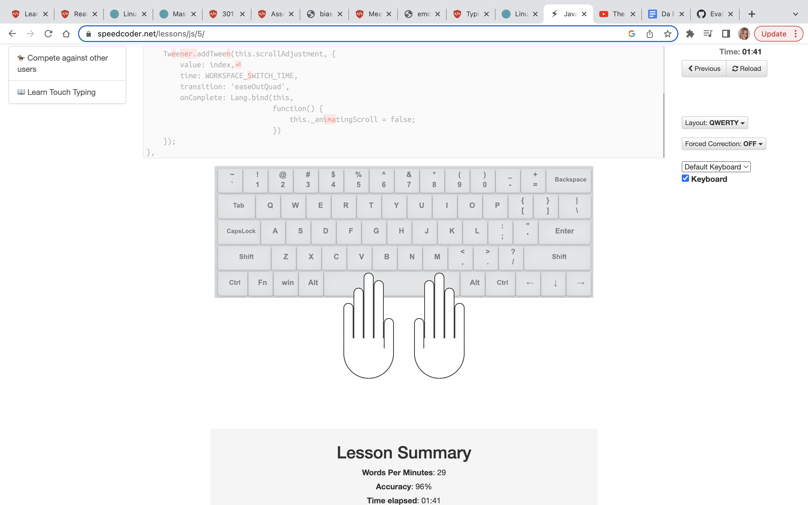
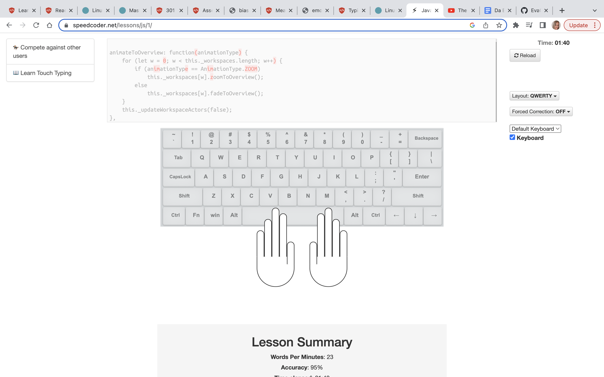
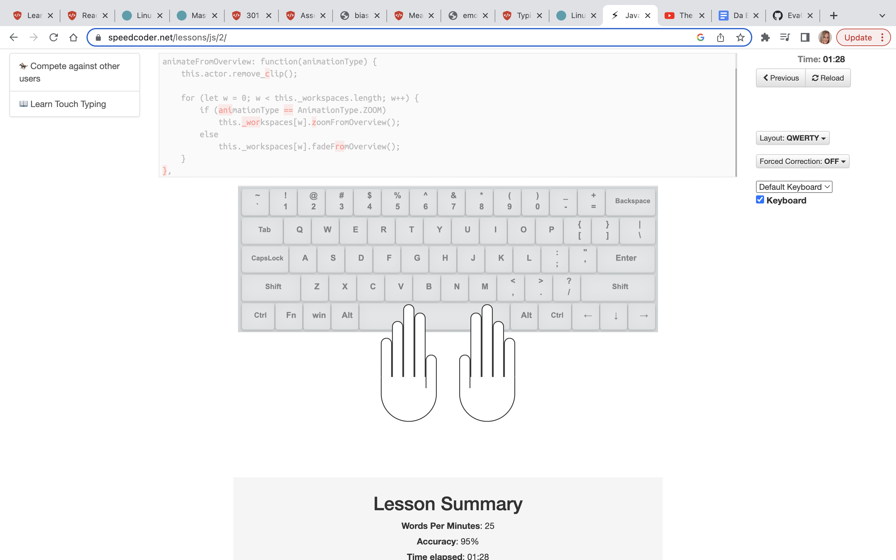

## [Typing Practice](https://codefellows.github.io/common_curriculum/prework/typing)
___

[Typing Practice](https://www.speedcoder.net/lessons/js/1/)

1.) Choose the language of your upcoming 401.

2.) Complete at least 50% of the lessons. *But we recommend that you keep on going!*

3.) Take a screenshot of each lesson summary that you complete.

* Lesson 1  
* Lesson 2  
* Lesson 3  
* Lesson 4  
* Lesson 5  
* Lesson 6  
* Lesson 7  
* Lesson 8  
* Lesson 9  
* Lesson 10 
* Lesson 11 
* Lesson 12 
* Lesson 13 
